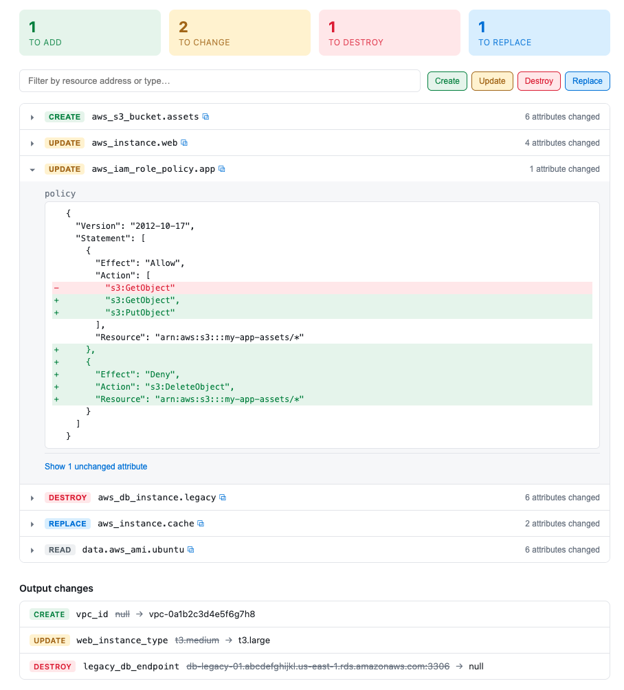

# terra-ui

A comfortable local viewer for Terraform/Terragrunt plan output.

`terra-ui` turns `terraform show -json` output into a searchable, filterable
HTML page that opens in your browser — no more scrolling through a wall of
plan text in the terminal to figure out what's actually changing.



## Features

- Structured summary of creates, updates, deletes, and replacements
- Search resources by address or type
- Filter by change action (create / update / delete / replace / read)
- Per-attribute diffs, including structural diffs for JSON-shaped values
  (e.g. IAM policy documents)
- Sensitive values are redacted per-leaf rather than collapsing the whole
  attribute
- Everything runs locally — the plan is embedded directly into a static HTML
  file, nothing is sent anywhere

## Installation

### Via GitHub

Install directly from a GitHub release tag:

```bash
npm install -g github:vadym-vorobel/terra-ui#v0.1.0
```

Or clone and build it yourself:

```bash
git clone https://github.com/vadym-vorobel/terra-ui.git
cd terra-ui
npm install
npm run build
npm link
```

`npm link` makes the `terra-ui` command available globally, pointing at your
local build.

## Usage

`terra-ui` reads a Terraform plan in JSON form, either from a file argument
or from stdin.

Generate the plan JSON with Terraform, then pipe it in:

```bash
terraform plan -out=tfplan
terraform show -json tfplan | terra-ui
```

Or point it at a saved JSON file:

```bash
terraform show -json tfplan > plan.json
terra-ui plan.json
```

This writes an HTML file to your system's temp directory and opens it in
your default browser.

Works the same way with Terragrunt:

```bash
terragrunt plan -out=tfplan
terragrunt show -json tfplan | terra-ui
```

> **Note:** `terraform plan -json` (the streaming log format) is not
> supported — it doesn't include attribute-level diffs. Use
> `terraform show -json <planfile>` instead, as shown above.

## Requirements

- Node.js >= 18

## Releasing

`dist/` is committed to the repo (not built on install) because `npm install
-g github:...` runs a package's `prepare` script without first installing
its `devDependencies`, so an install-time build isn't reliable for a
global git install. Before tagging a release:

```bash
npm run build
git add dist
git commit -m "Build vX.Y.Z"
git tag vX.Y.Z
git push origin main --tags
```
